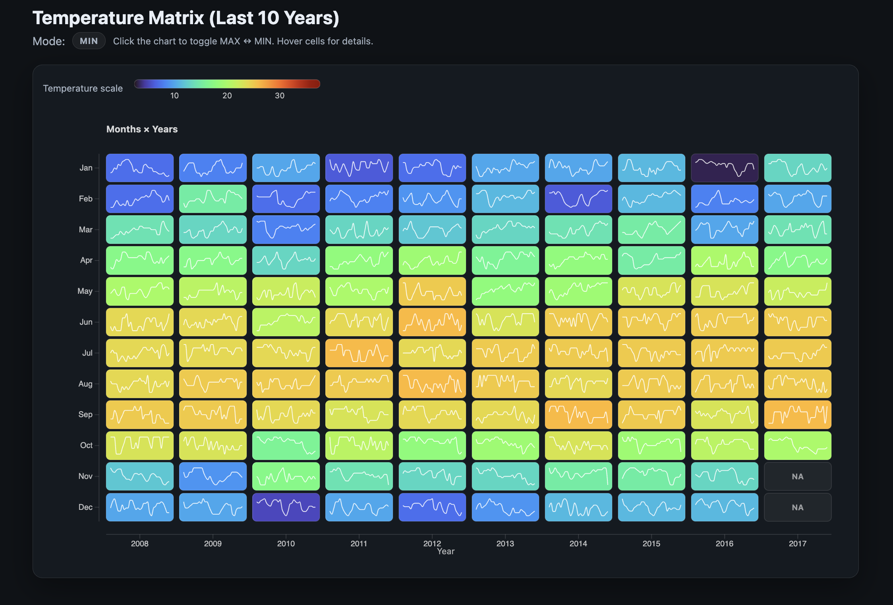
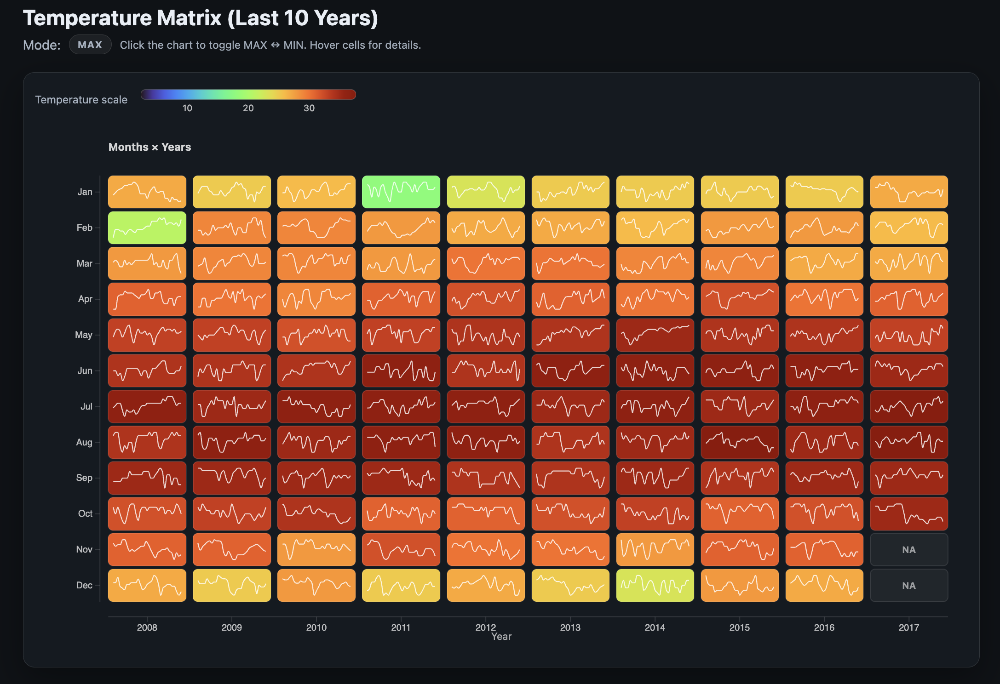

# 📊 Temperature Matrix Visualization (D3.js)

This project implements an interactive **Year × Month temperature matrix** using **D3.js**.

The visualization displays daily temperature data aggregated into monthly summaries for the **most recent 10 years** in the dataset.

---

## 🔍 Visualization Preview

  

  

---

## 📌 Features

### ✅ Matrix Layout
- **Columns** represent Years  
- **Rows** represent Months (Jan–Dec)  
- Each cell represents one `(Year, Month)` pair  

### ✅ Color Encoding
- Cell color represents:
  - **Monthly Maximum Temperature (MAX mode)**  
  - **Monthly Minimum Temperature (MIN mode)**  
- A continuous color legend displays the temperature scale.

### ✅ Mini Line Charts (Sparklines)
- Each cell contains a small line chart showing:
  - Daily temperature variation within that month
- Sparkline updates dynamically when toggling between MAX and MIN modes.

### ✅ Interaction
- **Click anywhere on the chart** → Toggle between MAX and MIN mode  
- **Hover over any cell** → Tooltip displays:
  - Year and Month
  - Current mode value (MAX or MIN)
  - Number of daily records
  - Monthly value range

---

## 📂 Project Structure